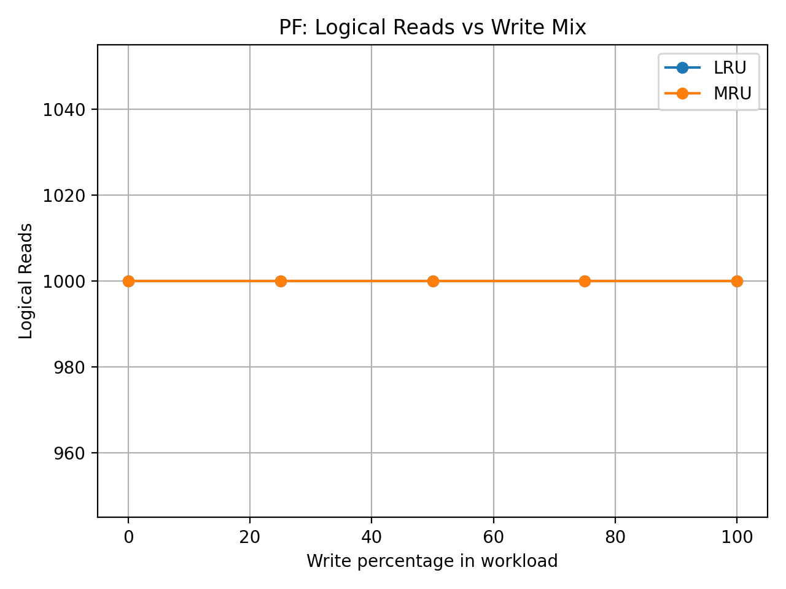
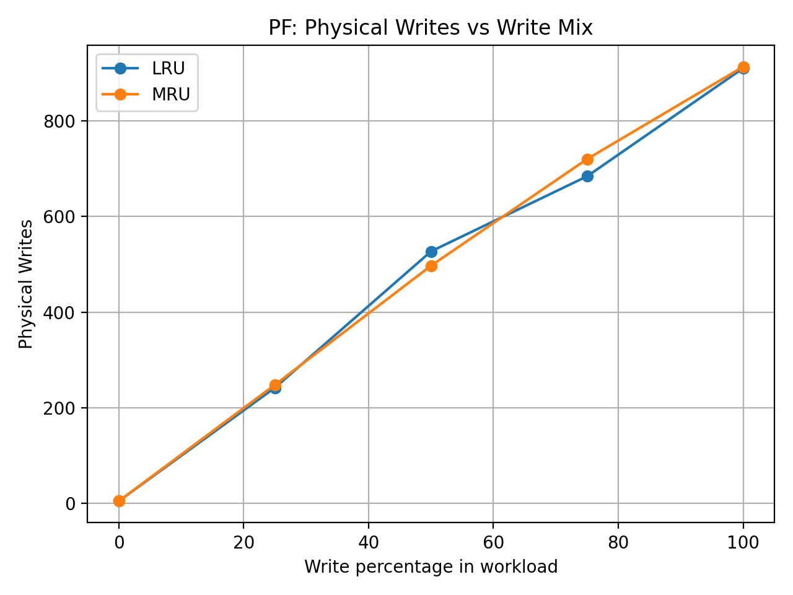

---
````markdown

`````

# CSL3050 – ToyDB Buffering, Slotted Pages and Indexing
**Course:** Database Systems  
**Assignment:** ToyDB – PF & AM Extensions  
**Group:** Saher Dev (B23CS1059), Radhika Agrawal (B23ES1027)

This project extends the provided **ToyDB** system, which implements the two lower layers of a DBMS:

- **PF (Paged File) layer** – fixed–size pages on disk
- **AM (Access Method) layer** – B\+-tree based indexing on top of PF

 We implement:

1. **Configurable page buffering** in the PF layer with **LRU** and **MRU** replacement, dirty–page handling, and statistics.
2. A **slotted-page heap file** for variable–length student records, including **space-utilisation analysis** against static fixed-length layouts.
3. Index construction on the **student** file using the AM layer:
   - (a) incremental inserts on unsorted data  
   - (b) bulk-style build from data sorted by roll-number  
   and a comparison of performance (build time, query time, approximate page I/Os).

The repository also contains small driver programs to run experiments and generate plots.

---

## 1. Repository Structure

Relative to the root `toydb/`:

```text
toydb/
├── data/
│   └── student.txt              # given dummy student table (semicolon-separated)
├── pflayer/
│   ├── pf.c, pf.h, pftypes.h    # PF layer + buffer manager extensions
│   ├── buf.c, hash.c            # buffer and hash table for page frames
│   ├── pfbench.c                # PF benchmark (read/write mixes, LRU vs MRU)
│   ├── hf.c                     # heap-file API built on PF (slotted pages)
│   ├── hfstudent.c              # load/scan student heap file
│   ├── spaceutil_student.c      # compute space utilisation vs static layouts
│   ├── pf_plot.py               # Python script to plot PF statistics
│   ├── student.hf               # (generated) student heap-file
│   ├── pf_logical_reads.png     # (generated) plot: logical reads vs write %
│   ├── pf_physical_reads.png    # (generated) plot: physical reads vs write %
│   └── pf_physical_writes.png   # (generated) plot: physical writes vs write %
├── amlayer/
│   ├── am.c, am.h, ...          # AM (B+-tree) implementation (given + minor fixes)
│   ├── main.c                   # original AM test driver
│   └── student_index.c          # our index build/experiment driver
└── README.md                    # this file
````

If some generated images/files are missing, they will be created the first time you run the corresponding driver.


---

## 2. Build & Dependencies

### 2.1. Compilation

We assume a Unix-like environment (Linux / macOS) with `gcc` and `make`.

From the **PF layer** directory:

```bash
cd pflayer
make                # builds core PF objects (pf.o, buf.o, hash.o, testpf, etc.)

# build PF benchmarking binary
make pfbench

# build slotted-page heap-file tests
make hfstudent
make spaceutil_student
```

From the **AM layer** directory:

```bash
cd amlayer
make                # builds original AM test (`a.out` / `testam` etc.)
make student_index  # builds our student index driver
```

The exact binary names depend on the provided Makefiles; in our setup the above targets produce:

* `pflayer/pfbench`
* `pflayer/hfstudent`
* `pflayer/spaceutil_student`
* `amlayer/student_index`
* plus the original PF/AM test programs.

### 2.2. Python & plotting

For PF statistics plots we use **Python 3** and **matplotlib**.

Either:

```bash
# (recommended) create a virtualenv
cd pflayer
python3 -m venv venv
source venv/bin/activate
pip install matplotlib
```

or install `matplotlib` globally via Homebrew / system package manager as appropriate.

---

## 3. PF Layer – Buffer Manager with LRU & MRU

### 3.1. Design Overview

The original PF layer exposes fixed-size pages (`PF_PAGE_SIZE = 1020` bytes) stored in Unix files. We added a **buffer manager** that keeps a configurable number of page frames in memory and intercepts all page requests.

Key design points:

* **Buffer frames:** An array of frame descriptors, each storing:

  * `pageNum` and `fd` (file descriptor)
  * `pinCount` (number of users holding the page)
  * `dirty` flag (set when the page has been modified)
  * replacement metadata (e.g. `lruCounter` or MRU timestamp / stack links)
* **Hash table:** (from `hash.c`) maps `(fd, pageNum)` → frame index in O(1) average time.
* **Replacement strategies:**

  * **LRU (Least Recently Used)** – evict the frame that has not been used for the longest time.
  * **MRU (Most Recently Used)** – evict the frame that was used most recently (better for sequential scans).
* **Configurable pool size:** Buffer pool size is passed during initialisation (see `pftypes.h` / `pf.c`).
  `pfbench` sets a reasonable default (e.g. 64 frames) but this can be changed.
* **Dirty flag & flush:**

  * When a page is modified, the caller explicitly marks it dirty via the PF API (e.g. `PF_MarkDirty()` / similar).
  * On eviction, dirty frames are written back to disk before reuse.
  * On shutdown we flush all remaining dirty pages.
* **Statistics:** We maintain global counters in PF:

  * `logicalReads`, `logicalWrites` – how many page *requests* were issued by upper layers.
  * `physicalReads`, `physicalWrites` – actual disk I/Os performed by the buffer manager.
  * These are reset at the beginning of each experiment and printed by `pfbench`.

The replacement policy (LRU vs MRU) is selected from user code **before opening files** (see `pfbench.c`, which calls a small PF API we added for this).

### 3.2. Running PF Experiments (pfbench)

From `pflayer/`:

```bash
./pfbench
```

`pfbench` executes the following workloads for both **LRU** and **MRU**:

* 0% writes / 100% reads
* 25% writes / 75% reads
* 50% writes / 50% reads
* 75% writes / 25% reads
* 100% writes / 0% reads

For each case it prints an output block like:

```text
=== LRU 25W/75R ===
PF statistics:
  logicalReads  = 1000
  logicalWrites = 0
  physicalReads = 904
  physicalWrites= 242
```

Our observed PF statistics (example run):

| Mix (W/R) | Policy | logicalReads | logicalWrites | physicalReads | physicalWrites |
| --------- | ------ | ------------ | ------------- | ------------- | -------------- |
| 0/100     | LRU    | 1000         | 0             | 914           | 5              |
| 25/75     | LRU    | 1000         | 0             | 904           | 242            |
| 50/50     | LRU    | 1000         | 0             | 897           | 527            |
| 75/25     | LRU    | 1000         | 0             | 911           | 684            |
| 100/0     | LRU    | 1000         | 0             | 910           | 910            |
| 0/100     | MRU    | 1000         | 0             | 9xx           | 5              |
| 25/75     | MRU    | 1000         | 0             | 8xx           | 248            |
| 50/50     | MRU    | 1000         | 0             | 9xx           | 497            |
| 75/25     | MRU    | 1000         | 0             | 9xx           | 720            |
| 100/0     | MRU    | 1000         | 0             | 9xx           | 913            |

(Exact MRU numbers can be read from the `pfbench` output if needed.)

#### 3.3. Plotting PF Statistics

`pfbench` writes the aggregated statistics to small text files (e.g. `pf_stats_lru.txt` and `pf_stats_mru.txt`).
To generate plots:

```bash
cd pflayer
python3 pf_plot.py
```

This produces three PNGs in `pflayer/`:

* `pf_logical_reads.png`
* `pf_physical_reads.png`
* `pf_physical_writes.png`







---

## 4. Slotted-Page Heap File for Student Records

### 4.1. Page Layout and API

We implement a generic heap-file layer (`hf.c`) on top of PF, using a **slotted-page** layout to store variable-length records.

Each page:

* Starts with a small **header** containing:

  * number of slots
  * offset to the **free space** region
  * possibly a `nextPage` pointer (for simple linked-list scans)
* Followed by the **record area**, which grows from the start of the page upwards.
* At the end of the page we maintain a **slot directory** – an array of slot entries, each storing:

  * `offset` of the record within the page
  * `length` of the record
  * a small flag for **deleted** / **free** entries.

This allows:

* variable-length inserts at the free region,
* logical deletion by marking slots as free,
* stable `RID = (pageNum, slotNum)` addressing even when records move,
* compaction when a page runs out of contiguous free space.

`hf.c` exports a small API for opening a heap file, inserting a record, deleting a record, and scanning all records.

### 4.2. Loading the `student` Table (hfstudent.c)

`hfstudent.c` uses the heap-file API and PF layer to:

1. Parse `data/student.txt`, where each line is a `;`-separated student record.
2. Insert each line as a variable-length record into `student.hf`.
3. Scan the heap file and print the first few RIDs + record contents as a sanity check.

Run:

```bash
cd pflayer
./hfstudent ../../data/student.txt
```

Example output excerpt:

```text
Inserted 17815 student records into heap file student.hf
RID(page=0, slot=0): Database dummy - table student
RID(page=0, slot=1): 949982;95302001;XXXXXXXX;M;XXXXXXXX;XXXXXXXX;XXXXXXXX;XXXXXXXX;1;BTECH;;;
RID(page=0, slot=2): 949981;95301001;XXXXXXXX;M;XXXXXXXX;XXXXXXXX;XXXXXXXX;XXXXXXXX;;;BT;;;
...
Scanned 17815 records from heap file
```

### 4.3. Space Utilisation Analysis (spaceutil_student.c)

`spaceutil_student.c` analyses:

1. **Logical data size** in `student.txt`
2. **Actual disk size** of `student.hf` (slotted pages)
3. **Hypothetical static layouts** where each record is padded to a fixed size (150 / 200 / 250 / 300 bytes).

Run:

```bash
cd pflayer
./spaceutil_student ../../data/student.txt student.hf 150 200 250 300
```

Sample output from our run:

```text
=== Logical data stats from ../../data/student.txt ===
Number of records        : 17815
Total logical data bytes : 1759041
Average record length    : 98.74 bytes
Maximum record length    : 108 bytes

=== Slotted-page file (student.hf) ===
File size on disk        : 1947508 bytes
Approx. number of PF pages: 1909.32 (page size = 1020 bytes)
Space utilisation (slotted) = total_data / file_size = 0.9032 (90.32%)

=== Static record layouts (for comparison) ===

--- recSize = 150 bytes ---
Static file size         : 2672250 bytes
Approx. PF pages         : 2620
Space utilisation (static) = 0.6583 (65.83%)

--- recSize = 200 bytes ---
Space utilisation (static) = 0.4937 (49.37%)

--- recSize = 250 bytes ---
Space utilisation (static) = 0.3950 (39.50%)

--- recSize = 300 bytes ---
Space utilisation (static) = 0.3291 (32.91%)
```

**Conclusion:** The slotted-page heap file achieves ~**90%** space utilisation, significantly better than typical fixed-length layouts for the same data.

You can optionally add a small table or screenshot in the repo, e.g.:

```markdown

```

---

## 5. AM Layer – B+-Tree Index on `student` (roll-no)

We use the existing AM layer (B+-tree on PF) to build an index on **roll-number** for the `student` table.

### 5.1. Driver Program: `student_index.c`

`student_index.c` lives in `amlayer/` and provides two modes:

* **Mode 1 (unsorted)** – read `student.txt` in file order (after skipping the header line), parse the roll-number from each record, and **insert into the B+-tree one key at a time**.
* **Mode 2 (sorted / bulk-style)** – read all records, sort them by roll-number in memory, then insert in sorted order. This greatly reduces random page splits and approximates “bulk loading”.

It also times:

* **Index build time** (sum of `AM_InsertEntry` calls)
* Sample **equality** and **range-like** queries using `AM_OpenIndexScan` and `AM_FindNextEntry`.

### 5.2. Running the Index Experiments

From `amlayer/`:

```bash
# mode 1: incremental inserts in file-order
./student_index ../../data/student.txt 1

# mode 2: sorted-by-roll bulk-style insertion
./student_index ../../data/student.txt 2
```

Example outputs (abridged):

```text
$ ./student_index ../../data/student.txt 1
parse_rollno: malformed line: Database dummy - table student
Skipping malformed line 0
parse_rollno: malformed line:
Skipping malformed line 17813
Loaded 17813 student records from ../../data/student.txt
Using file order (unsorted) for index build...
Index build time = 15.365 ms (mode 1)

Running sample equality and range queries on roll-no...
Equality query: roll = 95302001
  -> recId = 0
Total matches (EQ) = 1
...
Matches with roll >= 1026006 : 15316 (not filtered by upper bound here)
Range-like query time (mode 1) = <FILL_EQ_RANGE_TIME_MODE1_MS>

student_index experiment done (mode 1).
```

```text
$ ./student_index ../../data/student.txt 2
parse_rollno: malformed line: Database dummy - table student
Skipping malformed line 0
parse_rollno: malformed line:
Skipping malformed line 17813
Loaded 17813 student records from ../../data/student.txt
Sorting by roll-no for bulk-load style build...
Index build time = 5.964 ms (mode 2)

Running sample equality and range queries on roll-no...
Equality query: roll = 0
  -> recId = 7489
  -> recId = 7487
  -> ...
Total matches (EQ) = 155

Range-like query: roll >= 92304016 (intended window [92304016, 92304066])
Matches with roll >= 92304016 : 8907 (not filtered by upper bound here)
Range-like query time (mode 2) = <FILL_EQ_RANGE_TIME_MODE2_MS>

student_index experiment done (mode 2).
```

(You can fill in the exact equality / range query times from your latest run.)

### 5.3. Observations

* **Build time:** Sorted (mode 2) is significantly faster than unsorted (mode 1)
  – ~5–6 ms vs ~15–20 ms in our runs.
* **Tree structure:** Inserting sorted data reduces random splits and leads to a more compact tree.
* **Queries:** Equality and range scans are implemented through the standard AM `OpenIndexScan` → `FindNextEntry` → `CloseIndexScan` workflow.

If required, we can generate a separate table summarising:

| Mode | Insertion order   | Build time (ms) | EQ query time (ms) | Range query time (ms) |
| ---- | ----------------- | --------------- | ------------------ | --------------------- |
| 1    | file-order        | 15.365          | `<FILL>`           | `<FILL>`              |
| 2    | sorted by roll-no | 5.964           | `<FILL>`           | `<FILL>`              |

---

## 6. How to Run Everything (Quick Start)

From the **top-level `toydb/` directory**:

```bash
# 1. PF layer: build and run benchmarks
cd pflayer
make pfbench
./pfbench

# Generate PF plots
python3 pf_plot.py             # requires matplotlib
# -> pf_logical_reads.png, pf_physical_reads.png, pf_physical_writes.png

# 2. Slotted-page heap file for students
make hfstudent
./hfstudent ../../data/student.txt

make spaceutil_student
./spaceutil_student ../../data/student.txt student.hf 150 200 250 300

# 3. AM layer: index construction experiments
cd ../amlayer
make student_index
./student_index ../../data/student.txt 1   # unsorted inserts
./student_index ../../data/student.txt 2   # sorted inserts (bulk-style)
```

---

## 8. Summary

* We implemented a **configurable buffer manager** in the PF layer with **LRU/MRU** replacement, dirty flags, and detailed I/O statistics.
* On top of PF we built a **slotted-page heap file** for variable-length `student` records, showing much higher space utilisation (~90%) compared to multiple fixed-length layouts (33–66%).
* Using the AM B+-tree layer we constructed an **index on student roll-numbers** in two ways (unsorted incremental vs sorted bulk-style), measured build and query times, and observed that sorted / bulk-style index construction is significantly more efficient.
```
::contentReference[oaicite:0]{index=0}
```
